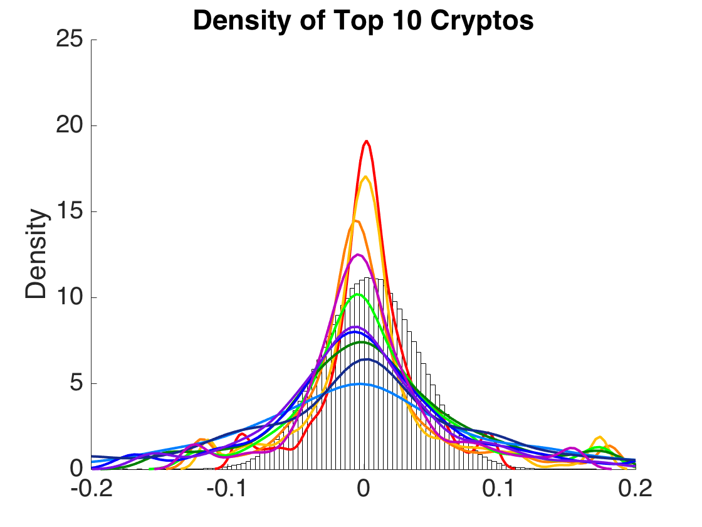

[](http://quantlet.de/)

## [](http://quantlet.de/) **CCPDescriptivestat** [](http://quantlet.de/)

```yaml

Name of QuantLet : CCPDescriptivestat

Published in : Risk-based versus target-based portfolio strategies in the cryptocurrency market

Description : 'Calculates traditional descriptive statistics for 55 cryptocurrencies and traditional assets, plots pdf of top-10 CC returns distributions'

Keywords : crypto, CRIX, cryptocurrency, variance, plot, pdf, returns


See also : 'CCPTests, CCPBootstrap, CCPPerformance_measures, CCPDiversification_measures'

Author : Alla Petukhina

Submitted : June 11 2018 by Alla Petukhina
Datafile : 'CCPData.mat'

Example : 
```



### MATLAB Code
```matlab

clc
clear
load('CCPData_winsyes_5_55_01-Jan-2015_29-Dec-2017.mat')
%%
[ b, ix ]   = sort( nanmean(CC_CAP()), 'descend' );
CC_RET_MAX  = CC_RET_wins(:,ix(1:11));
CC_TICK_MAX = CC_TICK(:,ix(1:11));
CC_RET_MAX(:,10)  = [];
CC_TICK_MAX(:,10) = [];
[CORR,P] = corrcoef([CC_RET_MAX, IND_RET]);
%% Save results to tex tables 
input.data                      = round(CORR,2);
input.tableColLabels            = [CC_TICK_MAX, IND_TICK];
input.tableRowLabels            = [CC_TICK_MAX, IND_TICK];
input.transposeTable            = 0;
input.dataFormatMode            = 'column'; 
input.dataNanString             = '-';input.tableColumnAlignment      = 'r';
input.tableBorders              = 0;
input.tableCaption              = strcat('Correlation of CC and traditional assets');
input.makeCompleteLatexDocument = 0;
latex                           = latexTable(input);


%% Densities of Top-10 CC
close all
rgb = 255;

color1  = [1 0 0];
color2  = [1 0.494117647409439 0];
color3  = [1 0.749019622802734 0];
color4  = [0 1 0];
color5  = [0 0.498039215803146 0];
color6  = [0 0.498039215803146 1];
color7  = [0 0 1];
color8  = [0.0784313753247261 0.168627455830574 0.549019634723663];
color9  = [0.749019622802734 0 0.749019622802734];
color10 = [0.47843137383461 0.062745101749897 0.894117653369904];
rainbow = [color1; color2;color3;color4;color5;color6;color7;color8;color9;color10];

r05 = mean(CC_RET_MAX(:,1))+std(CC_RET_MAX(:,1)).*randn(1000000,1);
pfig = figure
%set(figure,  'Position',  [100,  100,  1703,  548]);
hold on
ylim([0 25]);
xlim([-0.2 0.2]);
set(gca,'FontSize',20)
pfig = histogram(r05, 100, 'FaceColor', 'w', 'Normalization',  'pdf')

 for i = 1:10
[f,xi] =ksdensity(CC_RET_MAX(:,i));
plot(xi,f, 'Color', rainbow(i, :), 'LineWidth', 2)
%legend(CC_TICK_MAX,  'Location', 'SouthOutside', 'Orientation', 'horizontal')
%     plot(ksdensity(FUNDS(:,idx05(i))))
 end
[f_ind,xi_ind] =ksdensity(IND_RET(:,5));
%plot(xi_ind,f_ind, 'Color', 'k', 'LineWidth', 2)
ylabel('Density'), title('Density of Top 10 Cryptos')

hold off
saveas(pfig, strcat('PDF_TOP_10CC','.fig'));
saveas(pfig, strcat('PDF_TOP_10CC','.pdf'))
 

%% Building latex table with descriptive statistics for all constituents of the investment universe
CC_IND_RET = [CC_RET_wins, IND_RET];
input.data                      = [arrayfun(@(j) max(CC_IND_RET(:,j)), 1:size(CC_IND_RET,2));
                                   arrayfun(@(j) quantile(CC_IND_RET(:,j), 0.9), 1:size(CC_IND_RET,2));
                                   arrayfun(@(j) quantile(CC_IND_RET(:,j), 0.5), 1:size(CC_IND_RET,2));
                                   arrayfun(@(j) mean(CC_IND_RET(:,j)), 1:size(CC_IND_RET,2));
                                   arrayfun(@(j) quantile(CC_IND_RET(:,j), 0.1), 1:size(CC_IND_RET,2));
                                   arrayfun(@(j) min(CC_IND_RET(:,j)), 1:size(CC_IND_RET,2));
                                   arrayfun(@(j) std(CC_IND_RET(:,j)), 1:size(CC_IND_RET,2))]';
                               
input.tableRowLabels            = [CC_TICK,IND_TICK];
input.tableColLabels            = {'maximum','upper percentile', 'median', 'mean',...
                                   'lower percentile','minimum', 'volatility'};
input.transposeTable            = 0;
input.dataFormatMode            = 'column'; 
input.dataFormat                = {'%.2f'};
input.dataNanString             = '-';
input.tableColumnAlignment      = 'c';
input.tableBorders              = 0;
input.tableCaption              = 'Descriptive statistics on continuously compounded monthly returns returns of satllites mutual funds';
input.tableLabel                = 'Table1';
input.makeCompleteLatexDocument = 1;
latex                           = latexTable(input);
```

automatically created on 2018-06-21