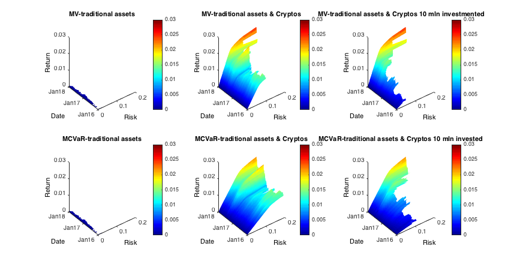

[](http://quantlet.de/)

## [](http://quantlet.de/) **CCPEfficient_surface** [](http://quantlet.de/)

```yaml

Name of QuantLet : CCPEfficient_surface

Published in : Risk-based versus target-based portfolio strategies in the cryptocurrency market

Description : 'Builds and plots Mean-Variance and Mean-CVaR efficient frontiers, cunstructed on daily basis'

Keywords : crypto, CRIX, cryptocurrency, portfolio, plot, time-series, expected shortfall


See also : 'CCPTests, CCPBootstrap, CCPPerformance_measures, CCPDiversification_measures'

Author : Alla Petukhina

Submitted : June 11 2018 by Alla Petukhina
Datafile : 'CCPData.mat'

Example : 
```



### MATLAB Code
```matlab

%% Plots of surfaces of efficient frontiers
% figure
% colormap([1 0 0;0 0 1])
% surf(repmat([1 2],30,1),  PRET_INDEX_CVAR(:,1:2),  PRSK_INDEX_CVAR(:,1:2), ones(size(PRET_CVAR(:,1:2))), 'EdgeColor', 'none' ); hold on%blue
% %, ones(size(PRSK_INDEX)))
% %surf(DATE_mat, PRET_INDEX,  PRSK_INDEX )%, ones(size(PRSK_INDEX)))
% surf(repmat([1 2],30,1),  PRET_CVAR(:,1:2), PRSK_CVAR(:,1:2), ones(size(PRET_CVAR(:,1:2)))+1, 'EdgeColor', 'none' );%,
%ones(size(PRSK_INDEX))+1);%red
 load('CCP_liquidity_constraint_yes_wins_yesrebal_daily26101-Jan-2015_29-Dec-2017_55_newCVAR.mat')
 PRSK_LIBRO = PRSK;
 PRET_LIBRO = PRET;
 PRSK_CVAR_LIBRO = PRSK_CVAR;
 PRET_CVAR_LIBRO = PRET_CVAR;
 load('CCP_liquidity_constraint_no_wins_yesrebal_daily26101-Jan-2015_29-Dec-2017_55_newCVAR.mat')
close all
DATE_mat = repmat(DATE(end-outsample_width+1:end)',30,1);
retlim = 0.03
risklim = 0.2
pfig = figure
colormap('jet')

% %colormap([1 0 0;0 0 1])
% surf( PRSK_IND,  DATE_mat, PRET_IND,  'EdgeColor', 'none' ); hold on%blue
% %, ones(size(PRSK_IND)))
% surf(DATE_mat, PRET_IND,  PRSK_IND )%, ones(size(PRSK_IND)))
% surf(PRSK,DATE_mat,  PRET,   'EdgeColor', 'none' );%, ones(size(PRSK_IND))+1);%red
% xlim([0 0.2])
% ylim([0 0.2])
% xlabel('Risk')
% ylabel('Return')


subplot(2,3,1)

surf( PRSK_IND,  DATE_mat, PRET_IND,  'EdgeColor', 'none' )%; hold on%blue

colorbar('EastOutside')
title('MV-traditional assets')
datetick('y','mmmyy')
grid off
xlabel('Risk')
ylabel('Date')
zlabel('Return')
 xlim([0 risklim])
 zlim([0 retlim])
 caxis([0 retlim])
% xlim([0 max([max(PRSK_IND),max(PRSK_IND_CVAR)])])
% zlim([0 0.0018])
% caxis([0 retlim])

subplot(2,3,4)
surf( PRSK_IND_CVAR,  DATE_mat, PRET_IND_CVAR,  'EdgeColor', 'none' ); hold on%blue
xlabel('Risk')
ylabel('Date')
zlabel('Return')

 xlim([0 risklim])
 zlim([0 retlim])
 caxis([0 retlim])
datetick('y','mmmyy')
% xlim([0 max([max(PRSK_IND),max(PRSK_IND_CVAR)])])
% zlim([0 0.0018])
title('MCVaR-traditional assets')
colorbar('EastOutside')
grid off

subplot2 = subplot(2,3,2)

surf(  PRSK,   DATE_mat,  PRET,'EdgeColor', 'none' ); hold on%,%ones(size(PRSK_IND))+1);%red%ones(size(DATE_mat))+1, 
% scatter3(RPRISK, DATE(end-outsample_width+1:end)',  RPRET, 'filled',  'MarkerFaceColor', 'red');
% scatter3(MDRISK, DATE(end-outsample_width+1:end)',  MDRET, 'filled',  'MarkerFaceColor', 'blue');
% scatter3(SRISK, DATE(end-outsample_width+1:end)',  SRET, 'filled',  'MarkerFaceColor', 'yellow');
% scatter3(MAXRET_RISK, DATE(end-outsample_width+1:end)',  MAXRET_RET, 'filled');
%scatter3(MINRISK_RISK, DATE(end-outsample_width+1:end)',  MINRISK_RET, 'filled');
%view(subplot2,[-212.3 17.2]);

xlabel('Risk')
ylabel('Date')
zlabel('Return')

 xlim([0 risklim])
 zlim([0 retlim])
 caxis([0 retlim])
datetick('y','mmmyy')

caxis([0 retlim])


title('MV-traditional assets & Cryptos')
colorbar('EastOutside')
grid off


subplot3 = subplot(2,3,5)
% 
surf(  PRSK_CVAR,   DATE_mat,  PRET_CVAR,'EdgeColor', 'none' );hold on%,%ones(size(PRSK_IND))+1);%red%ones(size(DATE_mat))+1, 
% scatter3(RPRISK, DATE(end-outsample_width+1:end)',  RPRET, 'filled',  'MarkerFaceColor', 'red');
% scatter3(MDRISK, DATE(end-outsample_width+1:end)',  MDRET, 'filled',  'MarkerFaceColor', 'blue');
% scatter3(SRISK, DATE(end-outsample_width+1:end)',  SRET, 'filled',  'MarkerFaceColor', 'yellow');
% scatter3(MAXRET_RISK_CVAR, DATE(end-outsample_width+1:end)',  MAXRET_RET_CVAR, 'filled');
% scatter3(MINRISK_RISK_CVAR, DATE(end-outsample_width+1:end)',  MINRISK_RET_CVAR, 'filled');
%view(subplot3,[-212.3 17.2]);

%ylim([0 0.2])
xlabel('Risk')
ylabel('Date')
zlabel('Return')
 xlim([0 risklim])
 zlim([0 retlim])
 caxis([0 retlim])
%zlim([0 max(max(PRET_CVAR))])
 title('MCVaR-traditional assets & Cryptos')
colorbar('EastOutside')
datetick('y','mmmyy')
grid off


subplot(2,3,3)
surf(  PRSK_LIBRO,   DATE_mat,  PRET_LIBRO,'EdgeColor', 'none' );%,%ones(size(PRSK_IND))+1);%red%ones(size(DATE_mat))+1, 
xlim([0 0.2])
ylim([0 0.2])
xlabel('Risk')
ylabel('Date')
zlabel('Return')
zlim([0 retlim])
caxis([0 retlim])
%zlim([0 max(max(PRET_CVAR))])
xlim([0 risklim])
 title('MV-traditional assets & Cryptos 10 mln investmented')
datetick('y','mmmyy')
grid off
colorbar('EastOutside')


subplot(2,3,6)
surf(PRSK_CVAR_LIBRO,   DATE_mat,  PRET_CVAR_LIBRO,'EdgeColor', 'none' );%,%ones(size(PRSK_IND))+1);%red%ones(size(DATE_mat))+1, 
xlim([0 0.2])
ylim([0 0.2])
xlabel('Risk')
ylabel('Date')
zlabel('Return')
zlim([0 retlim])
caxis([0 retlim])
%zlim([0 max(max(PRET_CVAR))])
xlim([0 risklim])
colorbar('EastOutside')
datetick('y','mmmyy')
grid off
title('MCVaR-traditional assets & Cryptos 10 mln invested')
orient(pfig,'landscape'); 
saveas(pfig, strcat('Efficient_frontiers_surfaces',rebal_freq,num2str(insample_width),'.png'))
saveas(pfig, strcat('Efficient_frontiers_surfaces',rebal_freq,num2str(insample_width),'.eps'))
```

automatically created on 2018-06-21