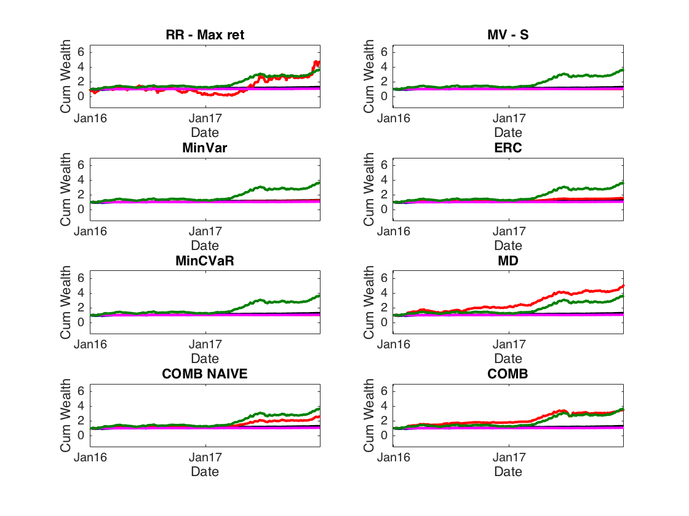
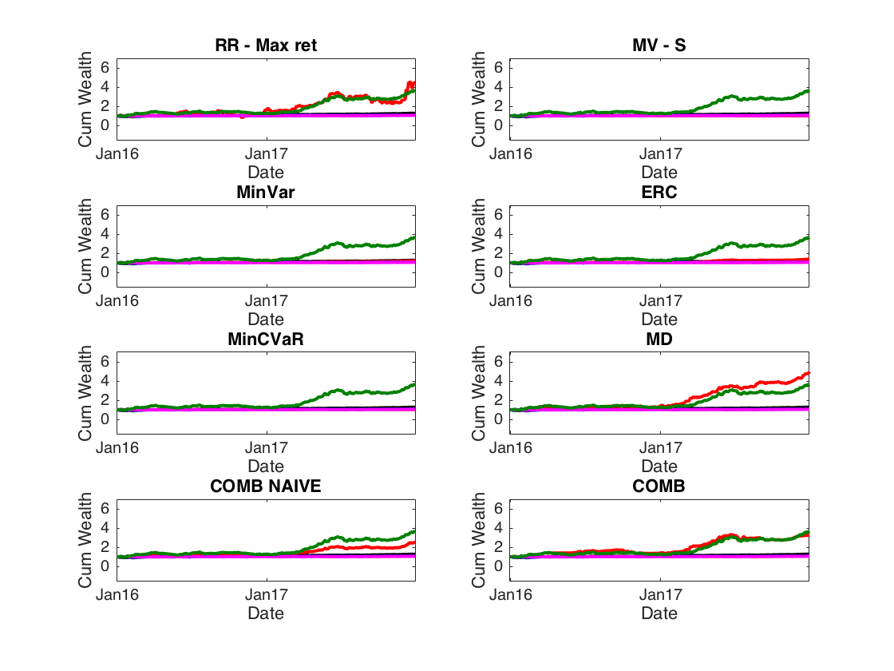

[](http://quantlet.de/)

## [](http://quantlet.de/) **CCPPerformance_measures** [](http://quantlet.de/)

```yaml

Name of QuantLet : CCPPerformance_measures

Published in : Risk-based versus target-based portfolio strategies in the cryptocurrency market

Description : 'Calculates: Sharpe ratio, Adjusted Sharpe ratio, Turnover, CEQ for 8 portfolios with cryptocurrencies'

Keywords : crypto, CRIX, cryptocurrency, portfolio, variance, plot, time-series, returns


See also : 'CCPTests, CCPBootstrap, CCPPerformance_measures, CCPConstruction, CCPDiversification_measures'

Author : Alla Petukhina

Submitted : June 11 2018 by Alla Petukhina
Datafile : 'CCPData.mat'

Example : 
```





### MATLAB Code
```matlab


%run('CCPConstruction.m')

%% Performance measures

sharpeIND             = mean(IND_RET(end-size(CC_IND_RET_EW,1)+1:end,4))/std(IND_RET(end-size(CC_IND_RET_EW,1)+1:end,4)); %5 - Euro stoxx 50 4 S&PP100
ceqIND                = mean(IND_RET(end-size(CC_IND_RET_EW,1)+1:end,4)) - 0.5*var(IND_RET(end-size(CC_IND_RET_EW,1)+1:end,4));
adjsharpeIND          = sharpeIND*(1+skewness(IND_RET(end-size(CC_IND_RET_EW,1)+1:end,4))/6*sharpeIND-(kurtosis(IND_RET(end-size(CC_IND_RET_EW,1)+1:end,4))-3)/24*sharpeIND^2);


sharpeIND_EW          = mean(IND_RET_EW)/std(IND_RET_EW); 
betaIND_EW            = cov(IND_RET_EW,IND_RET(end-size(CC_IND_RET_EW,1)+1:end,4))/var(IND_RET(end-size(CC_IND_RET_EW,1)+1:end,4)); %MArket - SP100
betaIND_EW            = betaIND_EW(2,1); 
treynorIND_EW         = mean(IND_RET(end-size(CC_IND_RET_EW,1)+1:end,4))/betaIND_EW; 
msquaredIND_EW        = mean(CC_IND_RET_EW)*(std(IND_RET(end-size(CC_IND_RET_EW,1)+1:end,5))/std(CC_IND_RET_EW)) - mean(IND_RET(end-size(CC_IND_RET_EW,1)+1:end,5)); 
jalphaIND_EW          = mean(CC_IND_RET_EW) - betaIND_EW*mean(IND_RET(end-size(CC_IND_RET_EW,1)+1:end,:)); 
ceqIND_EW             = mean(CC_IND_RET_EW) - 0.5*var(CC_IND_RET_EW); 
adjsharpeIND_EW       = sharpeIND_EW*(1+skewness(IND_RET_EW)/6*sharpeIND_EW-(kurtosis(IND_RET_EW)-3)/24*sharpeIND_EW^2);


sharpeIND_MAXRET      = nanmean(IND_RET_MAXRET)/nanstd(IND_RET_MAXRET); 
betaIND_MAXRET        = cov(IND_RET_MAXRET,IND_RET(end-size(CC_IND_RET_EW,1)+1:end,4))/var(IND_RET(end-size(CC_IND_RET_EW,1)+1:end,5)); %MArket - SP100
betaIND_MAXRET        = betaIND_MAXRET(2,1); 
treynorMAXRET         = mean(IND_RET)/betaIND_MAXRET;
msquareIND_MAXRET     = mean(IND_RET_MAXRET)*(std(IND_RET(end-size(CC_IND_RET_EW,1)+1:end,4))/std(IND_RET_MAXRET)) - mean(IND_RET(end-size(CC_IND_RET_EW,1)+1:end,4));  % (!!!) not only the rank, but also whether beats the market (beats if positINV_VOLAe)
jalphaIND_MAXRET      = mean(IND_RET_MAXRET) - betaIND_MAXRET*mean(IND_RET(end-size(CC_IND_RET_EW,1)+1:end,4));  % if the Jensen's alpha is positINV_VOLAe, then the portfolio has outperformed the market
ceqIND_MAXRET         = nanmean(IND_RET_MAXRET) - 0.5*nanvar(IND_RET_MAXRET);
adjsharpeIND_MAXRET   = sharpeIND_MAXRET*(1+skewness(IND_RET_MAXRET)/6*sharpeIND_MAXRET-(kurtosis(IND_RET_MAXRET)-3)/24*sharpeIND_MAXRET^2);

sharpeIND_MAXSHARPE      = nanmean(IND_RET_MAXSHARPE)/nanstd(IND_RET_MAXSHARPE); 
betaIND_MAXSHARPE        = cov(IND_RET_MAXSHARPE,IND_RET(end-size(CC_IND_RET_EW,1)+1:end,4))/var(IND_RET(end-size(CC_IND_RET_EW,1)+1:end,5)); %MArket - SP100
betaIND_MAXSHARPE        = betaIND_MAXSHARPE(2,1); 
treynorMAXSHARPE         = mean(IND_RET)/betaIND_MAXSHARPE;
msquareIND_MAXSHARPE     = mean(IND_RET_MAXSHARPE)*(std(IND_RET(end-size(CC_IND_RET_EW,1)+1:end,4))/std(IND_RET_MAXSHARPE)) - mean(IND_RET(end-size(CC_IND_RET_EW,1)+1:end,4));  % (!!!) not only the rank, but also whether beats the market (beats if positINV_VOLAe)
jalphaIND_MAXSHARPE      = mean(IND_RET_MAXSHARPE) - betaIND_MAXSHARPE*mean(IND_RET(end-size(CC_IND_RET_EW,1)+1:end,4));  % if the Jensen's alpha is positINV_VOLAe, then the portfolio has outperformed the market
ceqIND_MAXSHARPE         = nanmean(IND_RET_MAXSHARPE) - 0.5*nanvar(IND_RET_MAXSHARPE);
adjsharpeIND_MAXSHARPE   = sharpeIND_MAXSHARPE*(1+skewness(IND_RET_MAXSHARPE)/6*sharpeIND_MAXSHARPE-(kurtosis(IND_RET_MAXSHARPE)-3)/24*sharpeIND_MAXSHARPE^2);


sharpeEW              = mean(CC_IND_RET_EW)/std(CC_IND_RET_EW); 
betaEW                = cov(CC_IND_RET_EW,IND_RET(end-size(CC_IND_RET_EW,1)+1:end,4))/var(IND_RET(end-size(CC_IND_RET_EW,1)+1:end,4)); %MArket - SP100
betaEW                = betaEW(2,1); 
treynorEW             = mean(IND_RET)/betaEW; 
msquaredEW            = mean(CC_IND_RET_EW)*(std(IND_RET(end-size(CC_IND_RET_EW,1)+1:end,4))/std(CC_IND_RET_EW)) - mean(IND_RET(end-size(CC_IND_RET_EW,1)+1:end,4)); 
jalphaEW              = mean(CC_IND_RET_EW) - betaEW*mean(IND_RET(end-outsample_width+1:end,:)); 
ceqEW                 = mean(CC_IND_RET_EW) - 0.5*var(CC_IND_RET_EW); 
adjsharpeEW          = sharpeEW*(1+skewness(CC_IND_RET_EW)/6*sharpeEW-(kurtosis(CC_IND_RET_EW)-3)/24*sharpeEW^2);


sharpeMAXRET          = mean(CC_IND_RET_MAXRET)/std(CC_IND_RET_MAXRET); 
betaMAXRET            = cov(CC_IND_RET_MAXRET,IND_RET(end-size(CC_IND_RET_EW,1)+1:end,4))/var(IND_RET(end-size(CC_IND_RET_EW,1)+1:end,4)); %MArket - SP100
betaMAXRET            = betaMAXRET(2,1); 
treynorMAXRET         = mean(IND_RET)/betaMAXRET;
msquaredMAXRET        = mean(CC_IND_RET_MAXRET)*(std(IND_RET(end-size(CC_IND_RET_EW,1)+1:end,4))/std(CC_IND_RET_MAXRET)) - mean(IND_RET(end-size(CC_IND_RET_EW,1)+1:end,4));  % (!!!) not only the rank, but also whether beats the market (beats if positINV_VOLAe)
jalphaMAXRET          = mean(CC_IND_RET_MAXRET) - betaMAXRET*mean(IND_RET(end-size(CC_IND_RET_EW,1)+1:end,4));  % if the Jensen's alpha is positINV_VOLAe, then the portfolio has outperformed the market
ceqMAXRET             = mean(CC_IND_RET_MAXRET) - 0.5*var(CC_IND_RET_MAXRET); 
adjsharpeMAXRET       = sharpeMAXRET*(1+skewness(CC_IND_RET_MAXRET)/6*sharpeMAXRET-(kurtosis(CC_IND_RET_MAXRET)-3)/24*sharpeMAXRET^2);


sharpeMINVAR          = mean(CC_IND_RET_MINVAR)/std(CC_IND_RET_MINVAR); 
betaMINVAR            = cov(CC_IND_RET_MINVAR, IND_RET(end-size(CC_IND_RET_EW,1)+1:end,4))/var(IND_RET(end-size(CC_IND_RET_EW,1)+1:end,4)); %MArket - SP100
betaMINVAR            = betaMINVAR(2,1); 
treynorMINVAR         = mean(IND_RET)/betaMINVAR;
msquaredMINVAR        = mean(CC_IND_RET_MINVAR)*(std(IND_RET(end-size(CC_IND_RET_EW,1)+1:end,4))/std(CC_IND_RET_MINVAR)) - mean(IND_RET(end-size(CC_IND_RET_EW,1)+1:end,4));  % (!!!) not only the rank, but also whether beats the market (beats if positINV_VOLAe)
jalphaMINVAR          = mean(CC_IND_RET_MINVAR) - betaMINVAR*mean(IND_RET(end-size(CC_IND_RET_EW,1)+1:end,4));  % if the Jensen's alpha is positINV_VOLAe, then the portfolio has outperformed the market
ceqMINVAR             = mean(CC_IND_RET_MINVAR) - 0.5*var(CC_IND_RET_MINVAR); 
adjsharpeMINVAR       = sharpeMINVAR*(1+skewness(CC_IND_RET_MINVAR)/6*sharpeMINVAR-(kurtosis(CC_IND_RET_MINVAR)-3)/24*sharpeMINVAR^2);


sharpeMAXSHARPE       = mean(CC_IND_RET_MAXSHARPE)/std(CC_IND_RET_MAXSHARPE); 
betaMAXSHARPE         = cov(CC_IND_RET_MAXSHARPE,IND_RET(end-size(CC_IND_RET_EW,1)+1:end,4))/var(IND_RET(end-size(CC_IND_RET_EW,1)+1:end,4)); %MArket - SP100
betaMAXSHARPE         = betaMAXSHARPE(2,1); 
treynorMAXSHARPE      = mean(IND_RET)/betaMAXSHARPE;
msquaredMAXSHARPE     = mean(CC_IND_RET_MAXSHARPE)*(std(IND_RET(end-size(CC_IND_RET_EW,1)+1:end,4))/std(CC_IND_RET_MAXSHARPE)) - mean(IND_RET(end-size(CC_IND_RET_EW,1)+1:end,4)); 
jalphaMAXSHARPE       = mean(CC_IND_RET_MAXSHARPE) - betaMAXSHARPE*mean(IND_RET(end-size(CC_IND_RET_EW,1)+1:end,4)); 
ceqMAXSHARPE          = mean(CC_IND_RET_MAXSHARPE) - 0.5*var(CC_IND_RET_MAXSHARPE); 
adjsharpeMAXSHARPE       = sharpeMAXSHARPE*(1+skewness(CC_IND_RET_MAXSHARPE)/6*sharpeMAXSHARPE-(kurtosis(CC_IND_RET_MAXSHARPE)-3)/24*sharpeMAXSHARPE^2);


sharpeRP              = mean(CC_IND_RET_RP)/std(CC_IND_RET_RP); 
betaRP                = cov(CC_IND_RET_RP,IND_RET(end-size(CC_IND_RET_EW,1)+1:end,5))/var(IND_RET(end-size(CC_IND_RET_EW,1)+1:end,5)); %MArket - SP100
betaRP                = betaRP(2,1); 
treynorRP             = mean(IND_RET)/betaRP;
msquaredRP            = mean(CC_IND_RET_RP)*(std(IND_RET(end-size(CC_IND_RET_EW,1)+1:end,4))/std(CC_IND_RET_RP)) - mean(IND_RET(end-size(CC_IND_RET_EW,1)+1:end,4));  % (!!!) not only the rank, but also whether beats the market (beats if positINV_VOLAe)
jalphaRP              = mean(CC_IND_RET_RP) - betaRP*mean(IND_RET(end-size(CC_IND_RET_EW,1)+1:end,4));  % if the Jensen's alpha is positINV_VOLAe, then the portfolio has outperformed the market
ceqRP                 = mean(CC_IND_RET_RP) - 0.5*var(CC_IND_RET_RP); 
adjsharpeRP           = sharpeRP*(1+skewness(CC_IND_RET_RP)/6*sharpeRP-(kurtosis(CC_IND_RET_RP)-3)/24*sharpeRP^2);


sharpeIV              = mean(CC_IND_RET_IV)/std(CC_IND_RET_IV); 
betaIV                = cov(CC_IND_RET_IV,IND_RET(end-size(CC_IND_RET_EW,1)+1:end,4))/var(IND_RET(end-size(CC_IND_RET_EW,1)+1:end,4)); 
betaIV                = betaIV(2,1); 
treynorIV             = mean(IND_RET)/betaIV;
msquaredIV            = mean(CC_IND_RET_IV)*(std(IND_RET(end-size(CC_IND_RET_EW,1)+1:end,4))/std(CC_IND_RET_IV)) - mean(IND_RET(end-size(CC_IND_RET_EW,1)+1:end,4));  % (!!!) not only the rank, but also whether beats the market (beats if positINV_VOLAe)
jalphaIV              = mean(CC_IND_RET_IV) - betaIV*mean(IND_RET(end-size(CC_IND_RET_EW,1)+1:end,4));  % if the Jensen's alpha is positINV_VOLAe, then the portfolio has outperformed the market
ceqIV                 = mean(CC_IND_RET_IV) - 0.5*var(CC_IND_RET_IV); 
adjsharpeIV       = sharpeIV*(1+skewness(CC_IND_RET_IV)/6*sharpeIV-(kurtosis(CC_IND_RET_IV)-3)/24*sharpeIV^2);


sharpeMAXRET_CVAR     = mean(CC_IND_RET_MAXRET_CVAR)/std(CC_IND_RET_MAXRET_CVAR); 
betaMAXRET_CVAR       = cov(CC_IND_RET_MAXRET_CVAR,IND_RET(end-size(CC_IND_RET_EW,1)+1:end,4))/var(IND_RET(end-size(CC_IND_RET_EW,1)+1:end,4)); 
betaMAXRET_CVAR       = betaMAXRET_CVAR(2,1); 
treynorMAXRET_CVAR    = mean(IND_RET)/betaMAXRET_CVAR;
msquaredMAXRET_CVAR   = mean(CC_IND_RET_MAXRET_CVAR)*(std(IND_RET(end-size(CC_IND_RET_EW,1)+1:end,4))/std(CC_IND_RET_MAXRET_CVAR)) - mean(IND_RET(end-size(CC_IND_RET_EW,1)+1:end,4));  % (!!!) no only the rank, but also whether beats the market (beats if positINV_VOLAe)
jalphaMAXRET_CVAR     = mean(CC_IND_RET_MAXRET_CVAR) - betaMAXRET_CVAR*mean(IND_RET(end-size(CC_IND_RET_EW,1)+1:end,4));  % if the Jensen's alpha is positINV_VOLAe, then the portf_cvarolio has outperfomed the market
ceqMAXRET_CVAR        = mean(CC_IND_RET_MAXRET_CVAR) - 0.5*var(CC_IND_RET_MAXRET_CVAR); 
adjsharpeMAXRET_CVAR  = sharpeMAXRET_CVAR*(1+skewness(CC_IND_RET_MAXRET_CVAR)/6*sharpeMAXRET_CVAR-(kurtosis(CC_IND_RET_MAXRET_CVAR)-3)/24*sharpeMAXRET_CVAR^2);


sharpeMINVAR_CVAR     = mean(CC_IND_RET_MINVAR_CVAR)/std(CC_IND_RET_MINVAR_CVAR); 
betaMINVAR_CVAR       = cov(CC_IND_RET_MINVAR_CVAR, IND_RET(end-size(CC_IND_RET_EW,1)+1:end,4))/var(IND_RET(end-size(CC_IND_RET_EW,1)+1:end,4)); 
betaMINVAR_CVAR       = betaMINVAR_CVAR(2,1); 
treynorMINVAR_CVAR    = mean(IND_RET)/betaMINVAR_CVAR;
msquaredMINVAR_CVAR   = mean(CC_IND_RET_MINVAR_CVAR)*(std(IND_RET(end-size(CC_IND_RET_EW,1)+1:end,4))/std(CC_IND_RET_MINVAR_CVAR)) - mean(IND_RET(end-size(CC_IND_RET_EW,1)+1:end,4));  % (!!!) no only the rank, but also whether beats the market (beats if positINV_VOLAe)
jalphaMINVAR_CVAR     = mean(CC_IND_RET_MINVAR_CVAR) - betaMINVAR_CVAR*mean(IND_RET(end-size(CC_IND_RET_EW,1)+1:end,4));  % if the Jensen's alpha is positINV_VOLAe, then the portf_cvarolio has outperfomed the market
ceqMINVAR_CVAR        = mean(CC_IND_RET_MINVAR_CVAR) - 0.5*var(CC_IND_RET_MINVAR_CVAR); 
adjsharpeMINVAR_CVAR  = sharpeMINVAR_CVAR*(1+skewness(CC_IND_RET_MINVAR_CVAR)/6*sharpeMINVAR_CVAR -(kurtosis(CC_IND_RET_MINVAR_CVAR)-3)/24*sharpeMINVAR_CVAR^2);


% sharpeCOMB   = mean(CC_IND_RET_ALL_COMB_CEQ,1)./std(CC_IND_RET_ALL_COMB_CEQ,1);
% betaCOMB     = cov(CC_IND_RET_ALL_COMB_CEQ,IND_RET(end-size(CC_IND_RET_EW,1)+1:end,4))/var(IND_RET(end-size(CC_IND_RET_EW,1)+1:end,4)); %MArket - SP100
% betaCOMB     = betaCOMB(2,1);
% treynorCOMB  = mean(IND_RET)/betaCOMB;
% msquaredCOMB = mean(CC_IND_RET_ALL_COMB_CEQ)*(std(IND_RET(end-size(CC_IND_RET_EW,1)+1:end,4))/std(CC_IND_RET_ALL_COMB_CEQ)) - mean(IND_RET(end-size(CC_IND_RET_EW,1)+1:end,4));  % (!!!) not only the rank, but also whether beats the market (beats if positive)
% jalphaCOMB   = mean(CC_IND_RET_ALL_COMB_CEQ) - betaCOMB*mean(IND_RET(end-size(CC_IND_RET_EW,1)+1:end,4));  % if the Jensen's alpha is positive, then the portfolio has outperformed the market
% ceqCOMB      = mean(CC_IND_RET_ALL_COMB_CEQ,1) - 0.5*var(CC_IND_RET_ALL_COMB_CEQ,1); 
% adjsharpeCOMB       = sharpeCOMB*(1+skewness(CC_IND_RET_ALL_COMB_CEQ, 1)/6*sharpeCOMB-(kurtosis(CC_IND_RET_ALL_COMB_CEQ, 1)-3)/24*sharpeCOMB^2);


sharpeMD           = mean(CC_IND_RET_MD,1)./std(CC_IND_RET_MD,1);
betaMD             = cov(CC_IND_RET_MD,IND_RET(end-size(CC_IND_RET_EW,1)+1:end,4))/var(IND_RET(end-size(CC_IND_RET_EW,1)+1:end,4)); %MArket - SP100
betaMD             = betaMD(2,1);
treynorMD          = mean(IND_RET)/betaMD;
msquaredMD         = mean(CC_IND_RET_MD)*(std(IND_RET(end-size(CC_IND_RET_EW,1)+1:end,4))/std(CC_IND_RET_MD)) - mean(IND_RET(end-size(CC_IND_RET_EW,1)+1:end,4));  % (!!!) not only the rank, but also whether beats the market (beats if positINV_VOLAe)
jalphaMD           = mean(CC_IND_RET_MD) - betaMD*mean(IND_RET(end-size(CC_IND_RET_EW,1)+1:end,4));  % if the Jensen's alpha is positINV_VOLAe, then the portfolio has outperformed the market
ceqMD              = mean(CC_IND_RET_MD,1) - 0.5*var(CC_IND_RET_MD,1);
adjsharpeMD        = sharpeMD*(1+skewness(CC_IND_RET_MD,1)/6*sharpeMD-(kurtosis(CC_IND_RET_MD,1)-3)/24*sharpeMD^2);


% sharpeCOMBNAIVE   = mean(CC_IND_RET_ALL_COMB_NAIVE,1)./std(CC_IND_RET_ALL_COMB_NAIVE,1);
% betaCOMBNAIVE     = cov(CC_IND_RET_ALL_COMB_NAIVE,IND_RET(end-size(CC_IND_RET_EW,1)+1:end,4))/var(IND_RET(end-size(CC_IND_RET_EW,1)+1:end,4)); %MArket - SP100
% betaCOMBNAIVE     = betaCOMBNAIVE(2,1);
% treynorCOMBNAIVE  = mean(IND_RET)/betaCOMBNAIVE;
% msquaredCOMBNAIVE = mean(CC_IND_RET_ALL_COMB_NAIVE)*(std(IND_RET(end-size(CC_IND_RET_EW,1)+1:end,4))/std(CC_IND_RET_ALL_COMB_NAIVE)) - mean(IND_RET(end-size(CC_IND_RET_EW,1)+1:end,4));  % (!!!) not only the rank, but also whether beats the market (beats if positive)
% jalphaCOMBNAIVE   = mean(CC_IND_RET_ALL_COMB_NAIVE) - betaCOMBNAIVE*mean(IND_RET(end-size(CC_IND_RET_EW,1)+1:end,4));  % if the Jensen's alpha is positive, then the portfolio has outperformed the market
% ceqCOMBNAIVE      = mean(CC_IND_RET_ALL_COMB_NAIVE,1) - 0.5*var(CC_IND_RET_ALL_COMB_NAIVE,1); 
% adjsharpeCOMBNAIVE       = sharpeCOMBNAIVE*(1+skewness(CC_IND_RET_ALL_COMB_NAIVE)/6*sharpeCOMBNAIVE-(kurtosis(CC_IND_RET_ALL_COMB_NAIVE)-3)/24*sharpeCOMBNAIVE^2);


AWT_END_mat = cell2mat(AWT_END);
AWT_END_mat(isnan(AWT_END_mat)) = 0;
AWT_IND_END_mat = cell2mat(AWT_IND_END);
AWT_IND_END_mat(isnan(AWT_IND_END_mat)) = 0;
AWT_CVAR_END_mat = cell2mat(AWT_CVAR_END);
AWT_CVAR_END_mat(isnan(AWT_CVAR_END_mat)) = 0;
AWT_CVAR_mat = cell2mat(AWT_CVAR);
AWT_CVAR_mat(isnan(AWT_CVAR_mat)) = 0;
turnoverMAXRET        = sum(sum(abs(cell2mat(AWT(:,2:end))-AWT_END_mat(:,1:end-1))))/(length(cell2mat(AWT_END))-1);
turnoverIND_MAXRET    = sum(sum(abs(cell2mat(AWT_IND(:,2:end))-AWT_IND_END_mat(:,1:end-1))))/(length(cell2mat(AWT_END))-1);
turnoverIND_MAXSHARPE = sum(sum(abs(cell2mat(SWT_IND(:,2:end))-cell2mat(SWT_IND_END(:,1:end-1)))))/(length(cell2mat(AWT_END))-1);
turnoverMINVAR        = sum(sum(abs(cell2mat(PWT(:,2:end))-cell2mat(PWT_END(:,1:end-1)))))/(length(cell2mat(AWT_END))-1);
turnoverMAXSHARPE     = sum(sum(abs(cell2mat(SWT(:,2:end))-cell2mat(SWT_END(:,1:end-1)))))/(length(cell2mat(AWT_END))-1);
turnoverMINVAR_CVAR   = sum(sum(abs(cell2mat(PWT_CVAR(:,2:end))-cell2mat(PWT_CVAR_END(:,1:end-1)))))/(length(cell2mat(AWT_END))-1);
turnoverMAXRET_CVAR   = sum(sum(abs(AWT_CVAR_mat(:,2:end)-AWT_CVAR_END_mat(:,1:end-1))))/(length(cell2mat(AWT_END))-1);
turnoverMD            = sum(sum(abs(cell2mat(MDWT(:,2:end))-cell2mat(MDWT_END(:,1:end-1)))))/(length(cell2mat(AWT_END))-1);
turnoverRP            = sum(sum(abs(cell2mat(RPWT(:,2:end))-cell2mat(RPWT_END(:,1:end-1)))))/(length(cell2mat(AWT_END))-1);
turnoverIV            = sum(sum(abs(cell2mat(IWT(:,2:end))-cell2mat(IWT_END(:,1:end-1)))))/(length(cell2mat(AWT_END))-1);
% turnoverCOMB          = sum(sum(abs(cell2mat(CWT(:,2:end))-cell2mat(CWT_END(:,1:end-1)))))/(length(cell2mat(AWT_END))-1);
% turnoverCOMBNAIVE     = sum(sum(abs(cell2mat(NWT(:,2:end))-cell2mat(NWT_END(:,1:end-1)))))/(length(cell2mat(AWT_END))-1);
turnoverIND_EW        = sum(sum(abs(cell2mat(EWT_IND(:,2:end))-cell2mat(EWT_IND_END(:,1:end-1)))))/(length(cell2mat(AWT_END))-1);
turnoverEW            = sum(sum(abs(cell2mat(EWT(:,2:end))-cell2mat(EWT_END(:,1:end-1)))))/(length(cell2mat(AWT_END))-1);
turnoverIND           = 0; 


TURNOVER              = [turnoverIND; turnoverIND_EW; turnoverIND_MAXSHARPE;...
                         turnoverEW; turnoverMAXRET; turnoverMINVAR; ...
                         turnoverMAXSHARPE;  turnoverRP;  ...  
                         turnoverMINVAR_CVAR; turnoverMD];%;  turnoverCOMBNAIVE; turnoverCOMB]; 
CUMRET                = [cumretIND;  cumretIND_EW;  cumretIND_MAXSHARPE;...
                         cumretEW; cumretMAXRET; cumretMINVAR; ...
                         cumretMAXSHARPE; cumretRP;  ...
                         cumretMINVAR_CVAR;   cumretMD];%; cumretCOMBNAIVE; cumretCOMB]; 

SHARPE                = [sharpeIND; sharpeIND_EW;  sharpeIND_MAXSHARPE;  sharpeEW; ...
                         sharpeMINVAR;   sharpeMAXRET; sharpeMAXSHARPE; sharpeRP;...
                         sharpeMINVAR_CVAR;  sharpeMD];%;  sharpeCOMBNAIVE; sharpeCOMB];% 
    
CEQ                   = [ceqIND; ceqIND_EW; ceqIND_MAXSHARPE; ceqEW; ceqMINVAR; ...
                         ceqMAXRET; ceqMAXSHARPE; ceqRP;  ...
                         ceqMINVAR_CVAR;     ceqMD];%;  ceqCOMBNAIVE; ceqCOMB];
ADJSHARPE                = [adjsharpeIND; adjsharpeIND_EW;  adjsharpeIND_MAXSHARPE;  adjsharpeEW; ...
                         adjsharpeMINVAR;   adjsharpeMAXRET; adjsharpeMAXSHARPE; adjsharpeRP;...
                         adjsharpeMINVAR_CVAR;  adjsharpeMD];%;  adjsharpeCOMBNAIVE; adjsharpeCOMB];                      
                     
                         
%% Save results to tex tables 
input.data                      = [CUMRET(:,end), SHARPE, ADJSHARPE CEQ, TURNOVER ];
input.tableColLabels            = {'CW', 'SR',  'ASR', 'CEQ', 'Turnover'};
input.tableRowLabels            = {'SP100','EW Trad Assets ','MV-S Trad assets','EW',...
                                   'RR-max ret','MinVar','MV- S','ERC',  'MinCVAR', 'MD'};%, 'COMB NA\"IVE', 'COMB'}
input.transposeTable            = 0;
input.dataFormat                = {'%.3f'};
input.dataFormatMode            = 'column'; 
input.dataNanString             = '-';input.tableColumnAlignment      = 'r';
input.tableBorders              = 0;
input.tableCaption              = strcat('Performance rebalancing_', rebal_freq, '_liquidity constraint_',liquidity_const);
input.makeCompleteLatexDocument = 0;
latex                           = latexTable(input);

%% Plots of strategies out-of-sample
STRATRGY_TITLE = {'RR - Max ret', 'MV - S', 'MinVar', 'ERC',  'MinCVaR', 'MD'};%, 'COMB NAIVE', 'COMB'}
close all
ymin = -1.5;
ymax = 7;
xmin = DATE(end-length(cell2mat(DATE_OUT')));
xmax = DATE(end);
pfig = figure
for n = 5:size(CUMRET,1)
subplot(4,2,n-4)
plot(DATE(end-length(cell2mat(DATE_OUT')):end),[1,CUMRET(1,:)],'Color', 'k','LineWidth',2)%Index
datetick('x','mmmyy')
hold on
plot(DATE(end-length(cell2mat(DATE_OUT')):end),[1,CUMRET(n,:)],'Color', 'r','LineWidth',2)%Benchmark
plot(DATE(end-length(cell2mat(DATE_OUT')):end),[1,CUMRET(2,:)],'Color','b','LineWidth',2)%EW-TrA
plot(DATE(end-length(cell2mat(DATE_OUT')):end),[1,CUMRET(3,:)],'Color','m','LineWidth',2)%MV-S-TrA
plot(DATE(end-length(cell2mat(DATE_OUT')):end),[1,CUMRET(4,:)],'Color', [0 0.5 0],'LineWidth',2)%EW
title(STRATRGY_TITLE{n-4})
ylim([ymin ymax])
xlim([xmin xmax])
xlabel('Date')
ylabel('Cum Wealth')
hold off
end

%set(pfig, 'Position', [10 10 1000 625]);
savefig(pfig, strcat('CUMRET_liquidity_constraint_',liquidity_const,'rebal',rebal_freq,num2str(insample_width),'_',num2str(length(CC_TICK)),'.fig'));

orient(pfig,'portrait'); 
%fig.PaperPositionMode = 'manual';
pfig.PaperPositionMode = 'auto'
pfig_pos = pfig.PaperPosition;
pfig.PaperSize = [pfig_pos(3) pfig_pos(4)];
saveas(pfig, strcat('CUMRET_liquidity_constraint_',liquidity_const,'rebal',rebal_freq,num2str(insample_width),'_',num2str(length(CC_TICK)),'.pdf'))
 

```

automatically created on 2018-06-21