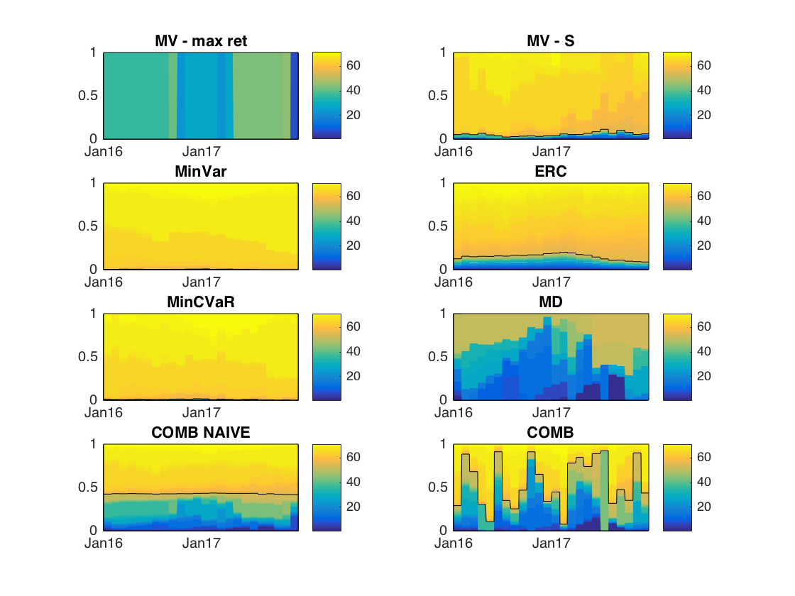
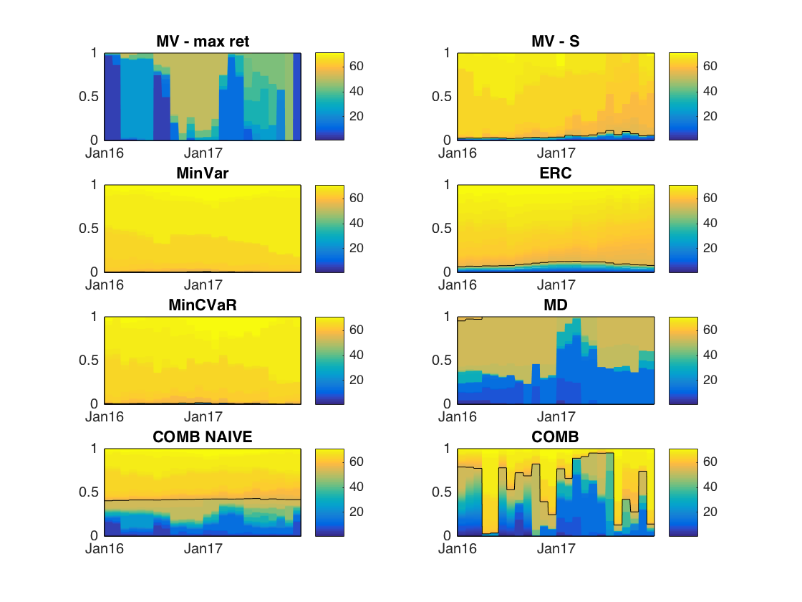

[](http://quantlet.de/)

## [](http://quantlet.de/) **CCPWeights** [](http://quantlet.de/)

```yaml

Name of QuantLet : CCPWeights

Published in : Risk-based versus target-based portfolio strategies in the cryptocurrency market

Description : 'Plots portfolio compositions for 8 monthly rebalanced portfolios with 55 cryptocurrencies and 16 traditional financial assests'

Keywords : crypto, CRIX, cryptocurrency, portfolio,  plot, time-series, returns


See also : 'CCPTests, CCPBootstrap, CCPPerformance_measures, CCPDiversification_measures, CCPConstruction'

Author : Alla Petukhina

Submitted : June 11 2018 by Alla Petukhina
Datafile : 'CCPData.mat'

Example : 
```





### MATLAB Code
```matlab

%run('CCPConstruction.m')
%% Plots of capital weights for different portfolio strategies
close all
%Capital contribution of assets
awt_weight      = [];
pwt_weight      = [];
swt_weight      = [];
iwt_weight      = [];
rpwt_weight     = [];
mdwt_weight     = [];
awt_cvar_weight = [];
pwt_cvar_weight = [];
cwt_weight       = [];
nwt_weight       = [];

ind               = length(IND_TICK);

tic    
 for n = 1:length(MDWT)
awt = AWT{n} ;
swt  = SWT{n};
awt_index = AWT_IND{n} ;
swt_index  = SWT_IND{n};
pwt =PWT{n};
rpwt = RPWT{n};
pwt_cvar = PWT_CVAR{n};
awt_cvar = AWT_CVAR{n} ;
mdwt =MDWT{n};
iwt =IWT{n};
cwt       = CWT{n};
nwt       = NWT{n};
Data = CC_IND_RET_IN{n}; 
date_out = DATE_OUT{n}' ; 
awt_weight      = [awt_weight, repmat(awt,1,length(date_out))];
pwt_weight      = [pwt_weight, repmat(pwt,1,length(date_out))];
swt_weight      = [swt_weight,repmat(swt,1,length(date_out))];
iwt_weight      = [iwt_weight, repmat(iwt,1,length(date_out))];
rpwt_weight     = [rpwt_weight, repmat(rpwt,1,length(date_out))];
mdwt_weight     = [mdwt_weight, repmat(mdwt,1,length(date_out))];
awt_cvar_weight = [awt_cvar_weight,repmat(awt_cvar,1,length(date_out))];
pwt_cvar_weight = [pwt_cvar_weight,repmat(pwt_cvar,1,length(date_out))];
cwt_weight      = [cwt_weight, repmat(cwt,1,length(date_out))];
nwt_weight      = [nwt_weight, repmat(nwt,1,length(date_out))];
 end

toc

%% Create a figure: Daily returns
WEIGHT_MAT       = {awt_weight, swt_weight, pwt_weight, rpwt_weight,  pwt_cvar_weight,   mdwt_weight};
STRATRGY_TITLE = {'MV - Max ret', 'MV - S', 'MinVar', 'ERC', 'MinCVaR', 'MD'};
pfig = figure


for n =1:length(WEIGHT_MAT)
weight = WEIGHT_MAT{n};
subplot(3,2,n)
area(cell2mat(DATE_OUT'),weight', 'LineStyle','none')
hold on 
ylim([0 1])
xlim([DATE(end-outsample_width+1) DATE(end)])
datetick('x','mmmyy','keeplimits')
area(cell2mat(DATE_OUT'), [sum(weight(1:end-ind,:)); sum(weight(end-ind +1:end,:))]','FaceAlpha',0, 'LineStyle','-')
colormap parula(72)
colorbar('EastOutside')
title(STRATRGY_TITLE{n})
%hold off
end
% hold off
% pfig = gcf;
% pfig.PaperPositionMode = 'manual'
%pfig_pos = pfig.PaperPosition;
%pfig.PaperSize = [pfig_pos(3) pfig_pos(4)];
%Save Figure in .fig and.pdf formats
savefig(pfig, strcat('Weights_distribution_liquidity_constraint_',liquidity_const,rebal_freq,num2str(insample_width),'_',num2str(length(CC_TICK)),'.fig'));
%orient(pfig,'portrait'); 
%pfig.Position = [0.5 0.5 0.5 0.5]
pfig.PaperPositionMode = 'auto'
pfig_pos = pfig.PaperPosition;
pfig.PaperSize = [pfig_pos(3) pfig_pos(4)];
saveas(pfig, strcat('Weights_distribution_liquidity_constraint_',liquidity_const,rebal_freq,num2str(insample_width),'_',num2str(length(CC_TICK)),'.pdf'))

%% Create a figure: Monthly returns
WEIGHT_MAT       = {awt_weight, swt_weight, pwt_weight, rpwt_weight,  pwt_cvar_weight,   mdwt_weight, nwt_weight, cwt_weight};
STRATRGY_TITLE = {'MV - max ret', 'MV - S', 'MinVar', 'ERC', 'MinCVaR', 'MD', 'COMB NAIVE', 'COMB'};
pfig = figure

for n =1:length(WEIGHT_MAT)
weight = WEIGHT_MAT{n};
subplot(4,2,n)
area(cell2mat(DATE_OUT'),weight', 'LineStyle','none');%[1:length(MDWT)]'
hold on 
ylim([0 1])
xlim([DATE(end-outsample_width+1) DATE(end)])
datetick('x','mmmyy','keeplimits')
area(cell2mat(DATE_OUT'), [sum(weight(1:end-ind,:)); sum(weight(end-ind +1:end,:))]','FaceAlpha',0, 'LineStyle','-');%[1:length(MDWT)]'
colormap parula(72)
colorbar('EastOutside')
title(STRATRGY_TITLE{n})
%hold off
end
% hold off
% pfig = gcf;
% pfig.PaperPositionMode = 'manual'
%pfig_pos = pfig.PaperPosition;
%pfig.PaperSize = [pfig_pos(3) pfig_pos(4)];
%Save Figure in .fig and.pdf formats
savefig(pfig, strcat('Weights_distribution_liquidity_constraint_',liquidity_const,rebal_freq,num2str(insample_width),'_',num2str(length(CC_TICK)),'.fig'));
%orient(pfig,'portrait'); 
%pfig.Position = [0.5 0.5 0.5 0.5]
pfig.PaperPositionMode = 'auto'
pfig_pos = pfig.PaperPosition;
pfig.PaperSize = [pfig_pos(3) pfig_pos(4)];
saveas(pfig, strcat('Weights_distribution_liquidity_constraint_',liquidity_const,rebal_freq,num2str(insample_width),'_',num2str(length(CC_TICK)),'.pdf'))


```

automatically created on 2018-06-21